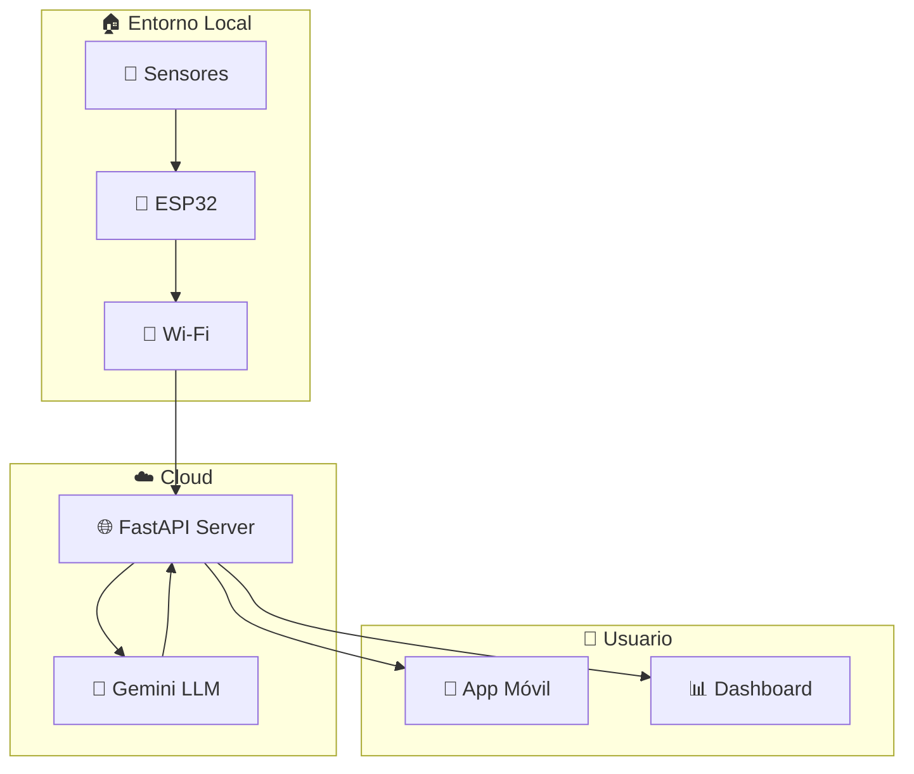
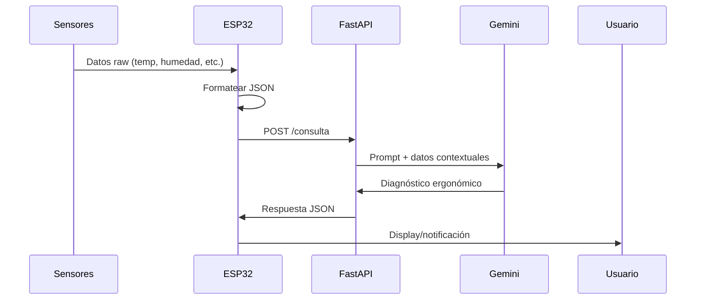

# 🏗️ Arquitectura del Sistema ConcentraTEC

## 🔍 Vista General

ConcentraTEC es un sistema distribuido que combina IoT, procesamiento en la nube y análisis con IA para diagnóstico ergonómico en tiempo real.



## 🏛️ Capas del Sistema

### 1. 📡 Capa de Percepción
**Responsabilidad**: Recolección de datos ambientales

**Componentes**:
- Sensor temperatura/humedad (DHT22)
- Micrófono para ruido (MAX9814)
- Sensor de luz (BH1750)
- Sensor de vibración (MPU-6050)

**Tecnologías**: I2C, ADC, sensores digitales

### 2. 🔧 Capa de Procesamiento Local
**Responsabilidad**: Agregación y transmisión de datos

**Componente**: ESP32 con MicroPython
- Lectura periódica de sensores
- Formateo de datos en JSON
- Gestión de conectividad Wi-Fi
- Buffer local para datos

**Flujo**:
```python
# Pseudocódigo simplificado
while True:
    data = collect_sensor_data()
    payload = format_json(data)
    send_to_cloud(payload)
    sleep(60)
```

### 3. 🌐 Capa de Comunicación
**Responsabilidad**: Interface entre hardware y LLM

**Componente**: FastAPI Server (Render)
- Endpoint `/consulta` para recibir datos
- Integración con Gemini API
- Formateo de prompts contextuales
- Gestión de errores y reintentos

**API Flow**:
```
POST /consulta → Gemini API → Diagnóstico → Response
```

### 4. 🤖 Capa de Inteligencia
**Responsabilidad**: Análisis y diagnóstico ergonómico

**Componente**: Google Gemini 1.5 Flash
- Procesamiento de datos ambientales
- Generación de diagnósticos
- Recomendaciones personalizadas
- Evaluación de riesgos ergonómicos

### 5. 📱 Capa de Presentación
**Responsabilidad**: Interface con el usuario

**Componentes** (futuro):
- App móvil para visualización
- Dashboard web
- Notificaciones push
- Histórico de datos

## 🔧 Decisiones de Diseño

### Arquitectura Distribuida
**Decisión**: Separar procesamiento local (ESP32) del análisis IA (cloud)
**Razón**: 
- ESP32 limitado para procesamiento de IA
- Gemini requiere conectividad constante
- Escalabilidad y mantenimiento

### Comunicación HTTP REST
**Decisión**: API REST sobre WebSockets/MQTT
**Razón**:
- Simplicidad de implementación
- Compatibilidad universal
- Debugging más sencillo

### Datos Simulados
**Decisión**: Usar datos simulados inicialmente
**Razón**:
- Desarrollo sin hardware físico
- Testing consistente
- Prototipado rápido

### Gemini como LLM
**Decisión**: Google Gemini vs OpenAI/Claude
**Razón**:
- API gratuita con cuotas generosas
- Latencia aceptable
- Capacidades multimodales futuras

## 🚀 Posibles Mejoras

### Corto Plazo
- **Buffer local**: Almacenar datos cuando no hay conectividad
- **Calibración**: Ajuste automático de sensores
- **Alertas locales**: LEDs/buzzer para feedback inmediato

### Mediano Plazo
- **Base de datos**: Persistencia de históricos
- **Dashboard web**: Visualización en tiempo real
- **Múltiples dispositivos**: Soporte para varios ESP32

### Largo Plazo
- **Edge AI**: Procesamiento local con TensorFlow Lite
- **Aprendizaje adaptativo**: Personalización por usuario
- **Integración IoT**: Compatibilidad con ecosistemas existentes

## 📊 Flujo de Datos



## 🔒 Consideraciones de Seguridad

- **API Keys**: Variables de entorno, no hardcoded
- **HTTPS**: Comunicación encriptada
- **Rate limiting**: Prevenir abuso de APIs
- **Validación**: Sanitización de datos de entrada

## 📈 Escalabilidad

**Actual**: 1 ESP32 → 1 servidor → 1 usuario
**Futuro**: N ESP32 → Load balancer → Base de datos → M usuarios

---

*Esta arquitectura permite evolución incremental manteniendo simplicidad inicial*