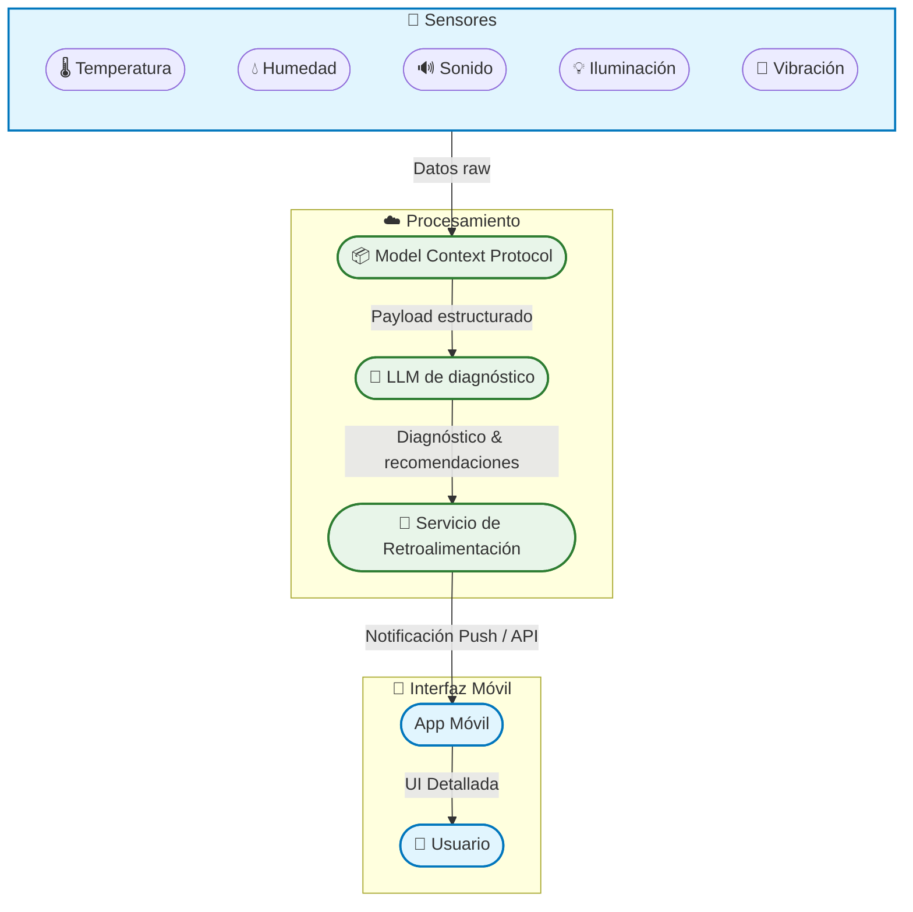

# EXPOCENFO-ConcentraTEC

## Integrantes

| Nombre    | Rol   |
|-----------|-------|
| Alonso Usaga Bonilla | Líder de Proyecto |
| Dylan Elizondo Alvarado | Encargado del LLM |
| Luis David Salgado Gámez | Programador |
| Jefferson Sandi Ramírez| Diseñador |

## 1. Estructura del Repositorio
``` plain-text
/docs/                   # Documentación extendida (diagramas, notas técnicas, PDFs)
/hardware/               # Esquemas, diagramas de conexión, archivos CAD/PCB
/software/               # Código fuente (microcontrolador, backend, scripts)
/tests/                  # Pruebas unitarias y de integración
/examples/               # Ejemplos simples de uso del sistema
README.md                # Descripción general del proyecto
ARCHITECTURE.md          # Documentación detallada de la arquitectura
SETUP.md                 # Guía de instalación y despliegue
CONTRIBUTING.md          # Normas para colaborar en el proyecto
LICENSE                  # Licencia del proyecto
```

**Descripción breve**
Un sistema inteligente que, a través de sensores de temperatura, humedad, sonido, iluminación y vibración, recolecta datos en tiempo real, los estructura con el Model Context Protocol (MCP) y los envía a un LLM para generar un diagnóstico ergonómico dinámico y personalizado.

---

**Objetivo del sistema**
Monitorear de manera continua y automática las condiciones ambientales de un espacio de trabajo, evaluar su adecuación ergonómica mediante un LLM y entregar al usuario recomendaciones claras y accionables tanto en tiempo real como a través de una aplicación móvil.

---

**Diagrama representativo**



> **Leyenda:**
>
> * **Sensores:** Capturan parámetros ambientales.
> * **MCP:** Estandariza y empaqueta la información.
> * **LLM:** Genera el diagnóstico ergonómico y recomendaciones.
> * **Feedback:** Orquesta el envío de resultados.
> * **App:** Presenta al usuario una interfaz detallada.
