# EXPOCENFO-ConcentraTEC

## Integrantes

| Nombre    | Rol   |
|-----------|-------|
| Alonso Usaga Bonilla | Líder de Proyecto |
| Dylan Elizondo Alvarado | Encargado del LLM |
| Luis David Salgado Gámez | Programador |
| Jefferson Sandi Ramírez| Diseñador |

## 1. Estructura del Repositorio
``` plain-text
/docs/                   # Documentación extendida (diagramas, notas técnicas, PDFs)
/hardware/               # Esquemas, diagramas de conexión, archivos CAD/PCB
/software/               # Código fuente (microcontrolador, backend, scripts)
/tests/                  # Pruebas unitarias y de integración
/examples/               # Ejemplos simples de uso del sistema
README.md                # Descripción general del proyecto
ARCHITECTURE.md          # Documentación detallada de la arquitectura
SETUP.md                 # Guía de instalación y despliegue
CONTRIBUTING.md          # Normas para colaborar en el proyecto
LICENSE                  # Licencia del proyecto
```

**Descripción breve**
Un sistema inteligente que, a través de sensores de temperatura, humedad, sonido, iluminación y vibración, recolecta datos en tiempo real, los estructura con el Model Context Protocol (MCP) y los envía a un LLM para generar un diagnóstico ergonómico dinámico y personalizado.

---

**Objetivo del sistema**
Monitorear de manera continua y automática las condiciones ambientales de un espacio de trabajo, evaluar su adecuación ergonómica mediante un LLM y entregar al usuario recomendaciones claras y accionables tanto en tiempo real como a través de una aplicación móvil.

---

**Diagrama representativo**

```mermaid
flowchart TB
  %% Sensores
  subgraph sensors["📡 Sensores"]
    direction TB
    T([🌡️ Temperatura])
    H([💧 Humedad])
    S([🔊 Sonido])
    L([💡 Iluminación])
    V([📳 Vibración])
  end

  %% Procesos en Cloud
  subgraph processes["☁️ Procesamiento"]
    direction TB
    MCP([📦 Model Context Protocol])
    LLM([🤖 LLM de diagnóstico])
    FB([🔔 Servicio de Retroalimentación])
  end

  %% Frontend
  subgraph ui["📱 Interfaz Móvil"]
    direction TB
    App([App Móvil])
    User([👤 Usuario])
  end

  %% Flujo de datos
  sensors -->|Datos raw| MCP
  MCP     -->|Payload estructurado| LLM
  LLM     -->|Diagnóstico & recomendaciones| FB
  FB      -->|Notificación Push / API| App
  App     -->|UI Detallada| User

  %% Estilos
  classDef devices   fill:#E1F5FE,stroke:#0277BD,stroke-width:2px,rounded:true;
  classDef services  fill:#E8F5E9,stroke:#2E7D32,stroke-width:2px,rounded:true;
  classDef endpoints fill:#FFF3E0,stroke:#EF6C00,stroke-width:2px,rounded:true;

  class sensors,App,User devices;
  class MCP,LLM,FB services;
```



> **Leyenda:**
>
> * **Sensores:** Capturan parámetros ambientales.
> * **MCP:** Estandariza y empaqueta la información.
> * **LLM:** Genera el diagnóstico ergonómico y recomendaciones.
> * **Feedback:** Orquesta el envío de resultados.
> * **App:** Presenta al usuario una interfaz detallada.
