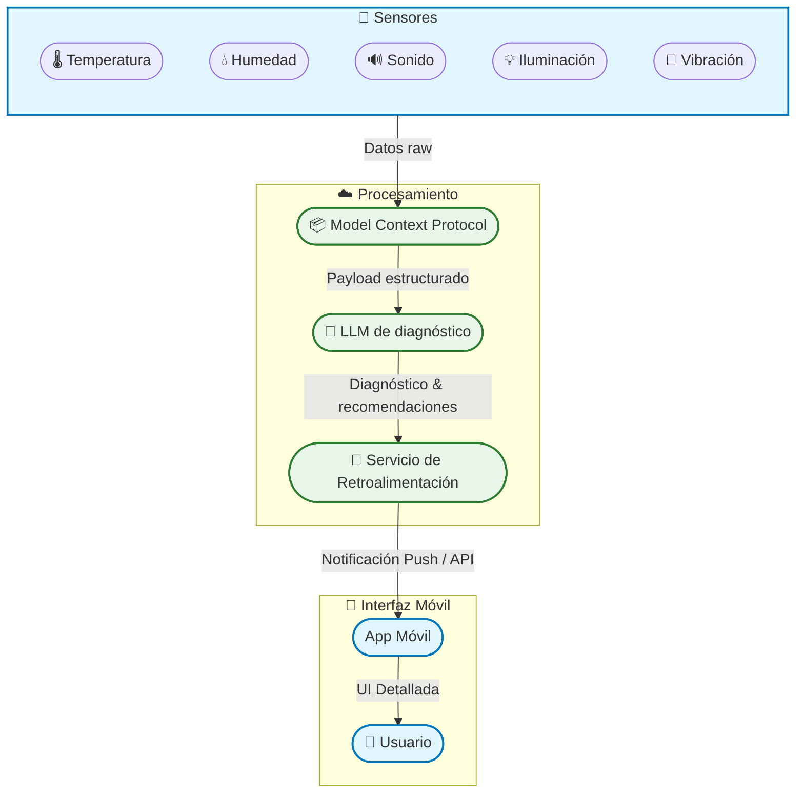

# Avance Preliminar del Proyecto

## 1. Información del Proyecto

* **Nombre del Proyecto:** ConcentraTEC
* **Equipo:** 
  * Alonso Usaga Bonilla.
  * Dylan Elizondo Alvarado.
  * Luis David Salgado Gámez.
  * Jefferson Sandi Ramírez.
* **Roles:**

  * **Líder de Proyecto:** Alonso Usaga Bonilla.
  * **Encargado del LLM:** Dylan Elizondo Alvarado.
  * **Programador Firmware / Backend:** Luis David Salgado Gámez.
  * **Diseñador UX/UI:** Jefferson Sandi Ramírez.

---

## 2. Descripción y Justificación

* **Problema que se aborda:**
  Los entornos de trabajo —especialmente en teletrabajo y espacios flexibles— no se evalúan de forma continua, lo que puede derivar en molestias físicas (dolor de espalda, fatiga visual) y estrés ambiental (ruido, vibraciones).

* **Importancia y contexto:**
  Con el auge del trabajo remoto y modelos híbridos, es vital contar con herramientas que monitoreen en tiempo real las condiciones ergonómicas. Esto reduce riesgos de salud ocupacional y mejora la productividad y bienestar.

* **Usuarios/beneficiarios:**

  * Profesionales en teletrabajo (home office).
  * Oficinas y espacios de coworking.
  * Departamentos de salud ocupacional y recursos humanos.

---

## 3. Objetivos del Proyecto

* **Objetivo General:**
  Desarrollar un sistema integral capaz de diagnosticar dinámicamente la ergonomía de un puesto de trabajo basándose en datos ambientales en tiempo real, y entregar recomendaciones personalizadas al usuario.

* **Objetivos Específicos:**

  1. Integrar sensores de temperatura, humedad, sonido, iluminación y vibración con un ESP32.
  2. Estructurar los datos usando el Model Context Protocol (MCP).
  3. Enviar el paquete MCP al LLM Gemini (Google Cloud) para obtener un diagnóstico ergonómico.
  4. Desplegar los resultados y recomendaciones en una aplicación móvil con interfaz amigable.
  5. Validar el sistema en un piloto con usuarios reales y ajustar umbrales y reportes.

---

## 4. Requisitos Iniciales

* **Hardware y Conectividad:**

  * Placa **ESP32** con Wi-Fi
  * Sensores:

    * Temperatura y humedad (DHT22/SHT31)
    * Sonido (micrófono MAX9814)
    * Iluminación (BH1750 o TSL2561)
    * Vibración (SW-420 o MPU-6050)
  * Actuadores (LED RGB, buzzer) opcionales para feedback local

* **Software y Servicios:**

  * **API Key** de Gemini (Google Cloud)
  * Endpoint:

    ```
    https://generativelanguage.googleapis.com/v1beta/models/gemini-2.0-flash:generateContent
    ```
  * Librerías:

    * Arduino Core for ESP32
    * Adafruit Sensor / DHT / BH1750 / MPU-6050
    * HTTPClient para ESP32
  * Aplicación móvil (Flutter o React Native)

---

## 5. Diseño Preliminar del Sistema

### 5.1 Arquitectura Inicial




### 5.2 Componentes previstos

* **Microcontrolador:**

  * ESP32 (dual-core 240 MHz, Wi-Fi/Bluetooth)

* **Sensores / Actuadores:**

  * DHT22/SHT31 (temp. & humedad)
  * MAX9814 (sonido)
  * BH1750/TSL2561 (iluminación)
  * SW-420 o MPU-6050 (vibración)
  * LED RGB y buzzer (feedback local)

* **LLM / API:**

  * Google Gemini v2.0-flash (nube)
  * Autenticación por X-goog-api-key

* **Librerías y Herramientas:**

  * Arduino ESP32 Core
  * Adafruit Sensor Suite
  * HTTPClient (ESP32)
  * Kotlin para la app móvil

### 5.3 Bocetos o esquemas


---

## 6. Plan de Trabajo

**Período: 15 de julio – 20 de agosto**

| Rango de Fechas       | Hito / Fase                                      | Actividades Clave                                                                 |
|-----------------------|--------------------------------------------------|-----------------------------------------------------------------------------------|
| **15 - 17 de julio**  | Inicio y planificación general                   | Definición de objetivos, tecnologías, asignación de roles, boceto de arquitectura. |
| **18 - 25 de julio**  | Diseño del sistema y estructura del repo         | Crear estructura `/docs`, `/software`, `/hardware`, empezar `README.md`.         |
| **26 jul - 1 ago**    | Desarrollo inicial y documentación base          | Captura de datos básica, subida de código base, bosquejo `ARCHITECTURE.md`.       |
| **2 de agosto**       | Preparación de entrega inicial                   | Validar estructura del repo, añadir primeros archivos a GitHub.                  |
| **📍 3 de agosto**     | Entrega del avance por GitHub                    | Entrega formal: incluir avances reales, estructura organizada, documentación mínima. |
| **4 - 8 de agosto**   | Mejoras técnicas y primeras pruebas              | Probar sensores, refinar software, inicio de `/tests/`, completar `SETUP.md`.     |
| **9 - 13 de agosto**  | Ejemplos y depuración                            | Subir ejemplos funcionales a `/examples/`, limpiar código, comenzar `CONTRIBUTING.md`. |
| **📍 14 de agosto**    | Envío del QR del GitHub                          | Confirmar repositorio operativo, revisado y con todo enlazado.                   |
| **15 - 18 de agosto** | Optimización final y revisión general            | Ejecutar pruebas finales, afinar entregables, subir `LICENSE`, preparar presentación. |
| **📍 19 de agosto**    | Entrega final del GitHub completo                | Todo debe estar funcional, probado y documentado.                                |
| **📍 20 de agosto**    | Olimpiadas de Computación Inteligente            | Presentación del sistema, demo funcional, justificación del diagnóstico ergonómico. |


### Riesgos y Mitigaciones

* **Conectividad Wi-Fi inestable**
  *Mitigación:* Buffer local y reintentos automáticos.

* **Latencia al invocar LLM**
  *Mitigación:* Cache de respuestas recientes y fallback local con reglas heurísticas.

* **Precisión/calibración de sensores**
  *Mitigación:* Calibración previa y filtros de software.

* **Gestión segura de la API Key**
  *Mitigación:* Uso de variables de entorno y backend proxy; no almacenar en firmware público.

---

## 7. Prototipos Conceptuales

```python
import time
import ujson
import urequests
import network
from machine import Pin, ADC, I2C
import ssd1306
import dht
from secrets import secrets

# ————— Configuración Wi-Fi —————
sta_if = network.WLAN(network.STA_IF)
sta_if.active(True)
sta_if.connect(secrets["ssid"], secrets["password"])
print("Conectando a Wi-Fi...", end="")
while not sta_if.isconnected():
    print(".", end="")
    time.sleep(0.5)
print("\nConectado. IP:", sta_if.ifconfig()[0])

SERVER = secrets["url_mcp"] + "/consulta"

# ————— Configuración sensores —————
# DHT22 en GPIO15
sensor_dht = dht.DHT22(Pin(15))

# LDR en GPIO33 (divisor 10 kΩ → GND)
adc_luz = ADC(Pin(33))
adc_luz.atten(ADC.ATTN_11DB)

# Micrófono analógico en GPIO32
adc_ruido = ADC(Pin(32))
adc_ruido.atten(ADC.ATTN_11DB)

# OLED para debug
i2c = I2C(0, scl=Pin(22), sda=Pin(21))
oled = ssd1306.SSD1306_I2C(128, 64, i2c)

def leer_sensores():
    # Lee temp/hum
    try:
        sensor_dht.measure()
        temp = sensor_dht.temperature()
        hum  = sensor_dht.humidity()
    except OSError:
        temp = None
        hum  = None

    # Lee luz y ruido
    luz   = adc_luz.read()
    vib = adc_ruido.read()


    return temp, hum, luz, vib

while True:
    # 1) Leer sensores reales
    temp, hum, luz, vib = leer_sensores()

    # 2) Montar payload JSON
    payload = {
        "temperature":  temp,
        "humidity":     hum,
        "light_level":  luz,
        "vibration_level":  vib,
        "sound_level": vib
    }
    body = ujson.dumps(payload)

    # 3) Enviar al servidor
    try:
        print("Enviando:", body)
        resp = urequests.post(SERVER,
                              headers={"Content-Type":"application/json"},
                              data=body)
        print("Status:", resp.status_code)
        print("Respuesta:", resp.text)
        resp.close()
    except Exception as e:
        print("Error al enviar:", e)

    # 4) Mostrar en OLED
    oled.fill(0)
    oled.text("T:{:.1f}C H:{:.1f}%".format(temp or 0, hum or 0), 0, 0)
    oled.text("Luz:{}".format(luz), 0, 10)
    oled.text("Ruido:{}".format(vib), 0, 20)
    oled.show()

    # 5) Esperar 60 s
    time.sleep(60)

```

**Ejemplo de respuesta recibida**
```json
Status: 200
Respuesta: {"respuesta":"Entorno Adecuado. La iluminación se encuentra en un nivel óptimo para la concentración, 
y los niveles de ruido y vibración son mínimos.\n\nRecomendaciones:\n\n1. Mantener la temperatura y humedad en 
los rangos ideales para la comodidad y productividad (generalmente entre 20-24°C y 40-60% de humedad relativa).\n
2. Asegurar una adecuada postura corporal con una silla ergonómica y una mesa de altura correcta para evitar la 
fatiga muscular"}
```

