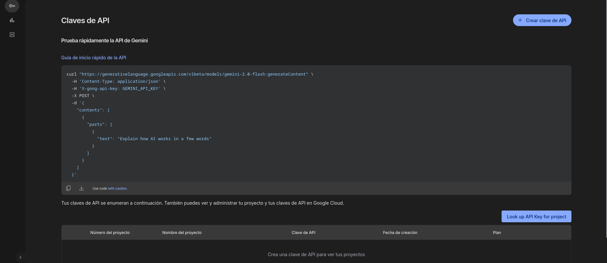
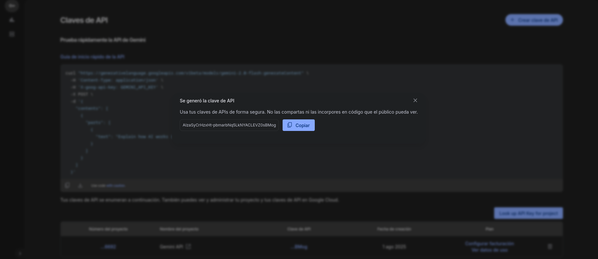

# Guía para Generar una API Key de Gemini en AI Studio

Sigue estos pasos para crear y gestionar tu clave de API de Gemini desde AI Studio. Todo el proceso se realiza en la siguiente URL:

> 🔗 [https://aistudio.google.com/app/apikey?hl=es\_419](https://aistudio.google.com/app/apikey)

---

## 1. Acceder a la consola de API Keys

1. Abre tu navegador y ve a:

   ```
   https://aistudio.google.com/app/apikey
   ```
2. Inicia sesión con la cuenta de Google asociada a tu proyecto de Google Cloud.

---

## 2. Crear una nueva clave de API

1. En la sección **Claves de API**, haz clic en el botón **Crear clave de API** (esquina superior derecha).

   

2. Tras unos segundos, verás un modal indicando **“Se generó la clave de API”**.

   

3. Haz clic en **Copiar** para copiar tu nueva clave al portapapeles.

   > **¡Atención!** Guarda tu clave en un lugar seguro. No la compartas ni la incluyas en repositorios públicos.

---

## 3. Ver y administrar tus claves existentes

En la misma página de **Claves de API** verás un listado con:

| Nº de proyecto | Nombre del proyecto | Clave de API | Fecha de creación | Plan / Facturación     |
| -------------- | ------------------- | ------------ | ----------------- | ---------------------- |
| …6692          | Gemini API          | …BMog        | 1 ago 2025        | Configurar facturación |

* **Configurar facturación**: Enlaza tu proyecto a una cuenta de facturación para ampliar cuotas.
* **Ver datos de uso**: Consulta métricas de consumo de tu clave.
* **🗑️ Eliminar**: Revoca la clave en cualquier momento.

---

## 4. Buenas prácticas de seguridad

* **No compartas** tu clave en foros, repositorios públicos o clientes móviles/SPA sin backend propio.
* **Restringe** el uso de la clave a direcciones IP o entornos específicos desde la consola de Google Cloud (Configuración de credenciales avanzadas).
* **Revoca** inmediatamente cualquier clave comprometida y crea una nueva.
