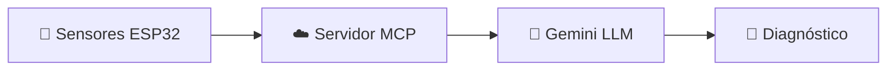

# 📚 Documentación del Proyecto ConcentraTEC

Bienvenido al centro de documentación del sistema de diagnóstico ergonómico inteligente **ConcentraTEC**. Aquí encontrarás toda la información necesaria para entender, configurar y utilizar el sistema.

## 🗂️ Índice de Documentación

### 📋 Documentación General
- **[README Principal](../README.md)** - Descripción general del proyecto y arquitectura
- **[Avance Preliminar CDIO](Avance_Preliminar_CDIO.md)** - Información detallada del proyecto, objetivos y plan de trabajo
- **[Arquitectura del Sistema](../ARCHITECTURE.md)** - Vista técnica de la arquitectura y componentes
- **[Guía de Contribución](../CONTRIBUTING.md)** - Normas para colaborar en el proyecto

### 🔧 Hardware y Componentes
- **[Componentes del Sistema](COMPONENTES.md)** - Descripción detallada de sensores, microcontroladores y actuadores
- **[Esquemas de Hardware](../hardware/)** - Diagramas de conexión y archivos CAD/PCB

### 💻 Software y Desarrollo

#### ESP32 (Microcontrolador)
- **[Código ESP32](CODE-ESP32.md)** - Guía completa para programar y configurar el ESP32
- **[Código Fuente ESP32](../software/ESP32/)** - Archivos de código y configuración

#### Servidor MCP (Backend)
- **[Despliegue en Render](MCP-RENDER.md)** - Guía para desplegar el servidor FastAPI en la nube
- **[Código Fuente MCP](../software/mcp/)** - Archivos del servidor backend

### 🔑 Configuración y APIs
- **[API Key de Gemini](GEMINI_API_KEY.md)** - Guía paso a paso para obtener y configurar la clave de API de Google Gemini

### 🖼️ Recursos Visuales
- **[Figuras y Capturas](figures/)** - Imágenes de apoyo para la documentación
  - `api-key.png` - Captura del proceso de generación de API key
  - `pagina-inicio-apikey.png` - Página inicial de AI Studio
  - `pagina-inicio.png` - Interfaz principal

## 🚀 Guía de Inicio Rápido

### Para Desarrolladores
1. **Configuración inicial**: Lee el [Avance Preliminar](Avance_Preliminar_CDIO.md) para entender el contexto
2. **Hardware**: Consulta [Componentes](COMPONENTES.md) para conocer los sensores necesarios
3. **API Setup**: Sigue la [Guía de API Key](GEMINI_API_KEY.md) para configurar Gemini
4. **Backend**: Despliega el servidor con [MCP-Render](MCP-RENDER.md)
5. **ESP32**: Programa el microcontrolador con [CODE-ESP32](CODE-ESP32.md)

### Para Usuarios Finales
1. **Descripción del sistema**: [README Principal](../README.md)
2. **Funcionalidades**: [Avance Preliminar](Avance_Preliminar_CDIO.md) - Sección de objetivos

## 🔄 Flujo del Sistema



## 📁 Estructura de Archivos

```
docs/
├── README.md                    ← Este archivo
├── Avance_Preliminar_CDIO.md    ← Información completa del proyecto
├── CODE-ESP32.md                ← Guía del microcontrolador
├── COMPONENTES.md               ← Hardware y sensores
├── GEMINI_API_KEY.md            ← Configuración de API
├── MCP-RENDER.md                ← Despliegue del servidor
└── figures/                     ← Imágenes de apoyo
    ├── api-key.png
    ├── pagina-inicio-apikey.png
    └── pagina-inicio.png
```

## 🎯 Casos de Uso por Rol

### 👨‍💻 Desarrollador de Hardware
- [Componentes](COMPONENTES.md) → [CODE-ESP32](CODE-ESP32.md) → [Arquitectura](../ARCHITECTURE.md)

### 👩‍💻 Desarrollador de Backend
- [MCP-Render](MCP-RENDER.md) → [API Key](GEMINI_API_KEY.md) → [Código MCP](../software/mcp/)

### 🏢 Implementador del Sistema
- [README Principal](../README.md) → [Avance Preliminar](Avance_Preliminar_CDIO.md) → [Guías específicas]

### 🔬 Investigador/Evaluador
- [Avance Preliminar](Avance_Preliminar_CDIO.md) → [Arquitectura](../ARCHITECTURE.md) → [Componentes](COMPONENTES.md)

## 🆘 Soporte y Contribución

- **Problemas técnicos**: Consulta la documentación específica del componente
- **Contribuciones**: Lee [CONTRIBUTING.md](../CONTRIBUTING.md)
- **Arquitectura**: Revisa [ARCHITECTURE.md](../ARCHITECTURE.md)